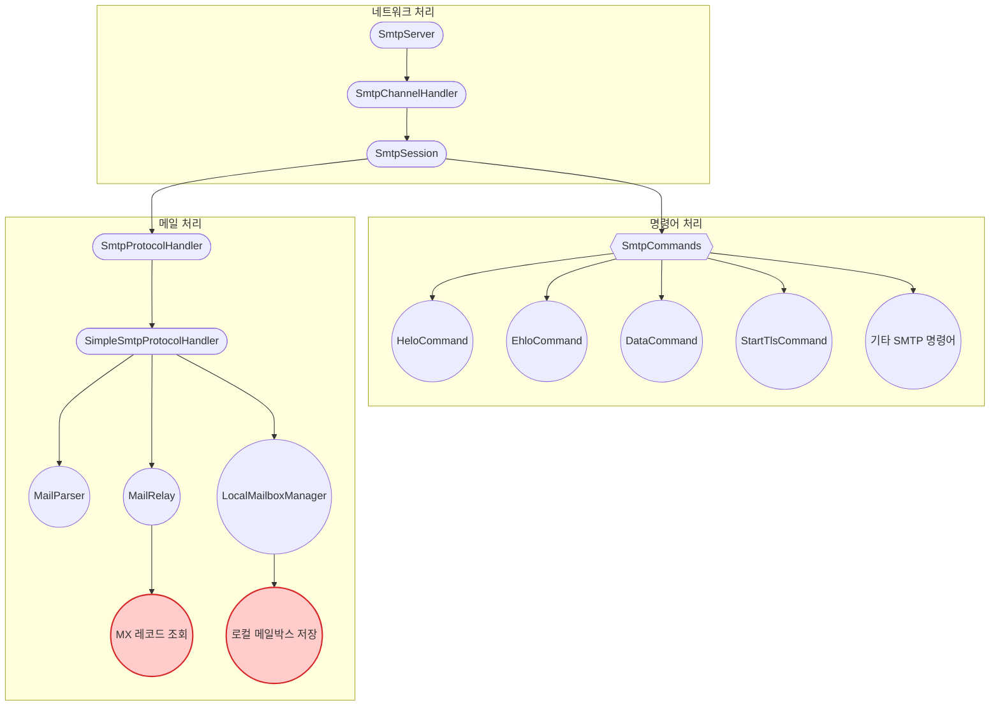

# Kotlin SMTP 서버

Kotlin으로 구현된 경량화된 SMTP 서버입니다. Netty 프레임워크를 기반으로 비동기 네트워크 처리를 지원하며, 코루틴을 활용한 효율적인 동시성 처리가 특징입니다.

## 주요 기능

- **SMTP 프로토콜 구현**: RFC 5321 기반 SMTP 명령어 지원
- **TLS 보안 연결**: STARTTLS 명령을 통한 보안 연결 지원
- **로컬 메일박스 관리**: 로컬 도메인 메일 저장 및 관리
- **외부 메일 릴레이**: MX 레코드 조회를 통한 외부 메일 서버 릴레이
- **확장성 있는 구조**: 커스텀 프로토콜 핸들러 구현 가능

## 아키텍처

### 네트워크 처리

- **SmtpServer**: 서버 설정 및 Netty 부트스트랩 관리
- **SmtpChannelHandler**: Netty 채널 이벤트 처리 및 세션 관리
- **SmtpSession**: SMTP 세션 상태 및 클라이언트 통신 관리

### 명령어 처리

- **SmtpCommands**: SMTP 명령어 라우팅 및 처리
- **HeloCommand, EhloCommand**: 클라이언트 인사 처리
- **MailCommand, RcptCommand**: 발신자/수신자 설정
- **DataCommand**: 메일 본문 데이터 처리
- **StartTlsCommand**: TLS 보안 연결 시작

### 메일 처리

- **SmtpProtocolHandler**: 메일 트랜잭션 처리 인터페이스
- **SimpleSmtpProtocolHandler**: 기본 메일 처리 구현체
- **MailParser**: 이메일 데이터 파싱 및 MimeMessage 변환
- **MailRelay**: 외부 메일 서버로 메일 릴레이 (MX 레코드 조회)
- **LocalMailboxManager**: 로컬 사용자 메일박스 관리

## 설정 방법

`application.yml` 파일에서 다음 설정을 구성할 수 있습니다:

```yaml
smtp:
  port: 25                           # SMTP 서버 포트
  hostname: localhost                # 서버 호스트명
  serviceName: kotlin-smtp           # 서비스 이름
  
  ssl:
    enabled: false                   # SSL/TLS 사용 여부
    certChainFile: /path/to/cert     # 인증서 체인 파일 경로
    privateKeyFile: /path/to/key     # 개인 키 파일 경로
```

## 향후 개발 계획

- Redis 기반 MX 레코드 캐싱
- 다중 로컬 도메인 지원
- 사용자 인증 기능 추가
- 메시지 필터링 및 스팸 방지 기능
- 클러스터링 지원

## 라이선스

MIT License